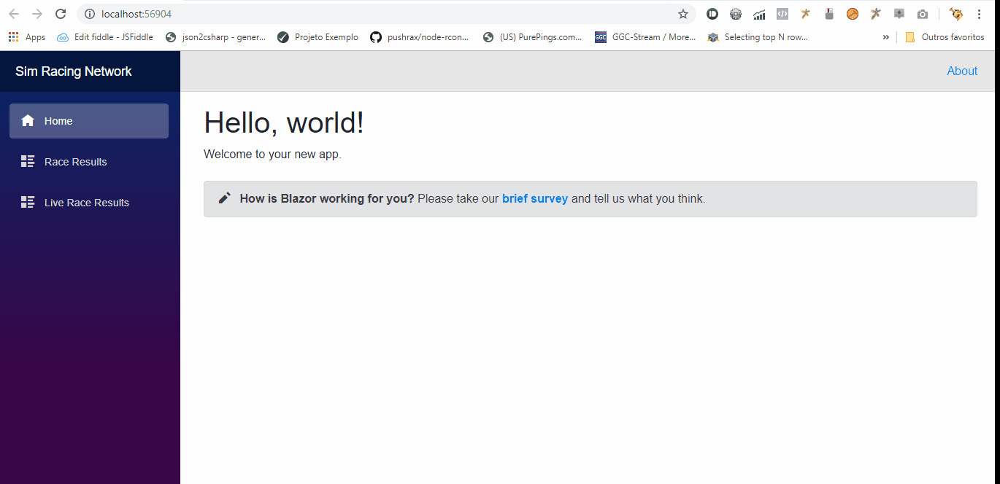

# BlazorMongoDbRealtime
Simple Blazor project with live data using mongoDB change stream

# Requeriments
For this project to work it is necessary to install mongoDB.

As the project uses the mongoDB change stream, it must be configured with a replica set.
To simplify I recommend using the Zero-config MongoDB runner that already automatically configures mongodb in replica, including downloading mongodb.
link: https://www.npmjs.com/package/run-rs
If the default isnt created create an database named "test" 
Create a colletion "raceresults" using  
 db.createCollection("raceresults")
To test run db.raceresults.insert({ "Server":"test", "Track": "Test Track"})
# Change the connections string and database name:
Change the connection string in appsettings.json to your mongoDB replica set
```json
{
  "ConnectionStrings": {
    "RaceResultsDb": "mongodb://BEKNAZAR-PC:27017,BEKNAZAR-PC:27018,BEKNAZAR-PC:27019/?replicaSet=rs"
  },
  "Logging": {
    "IncludeScopes": false,
    "Debug": {
      "LogLevel": {
        "Default": "Warning"
      }
    },
    "Console": {
      "LogLevel": {
        "Default": "Warning"
      }
    }
  }
}
```


